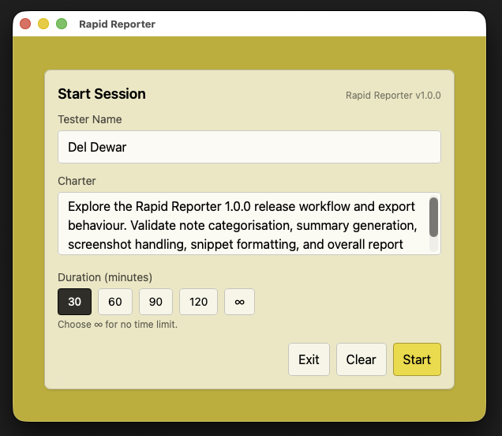
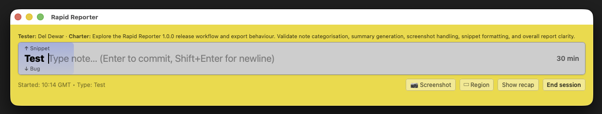
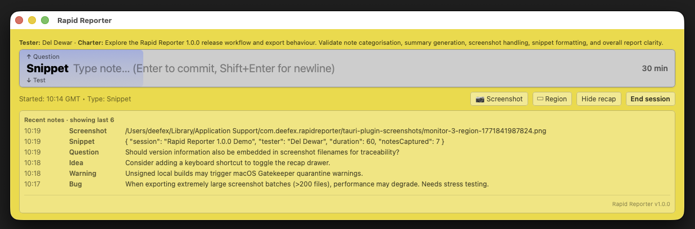
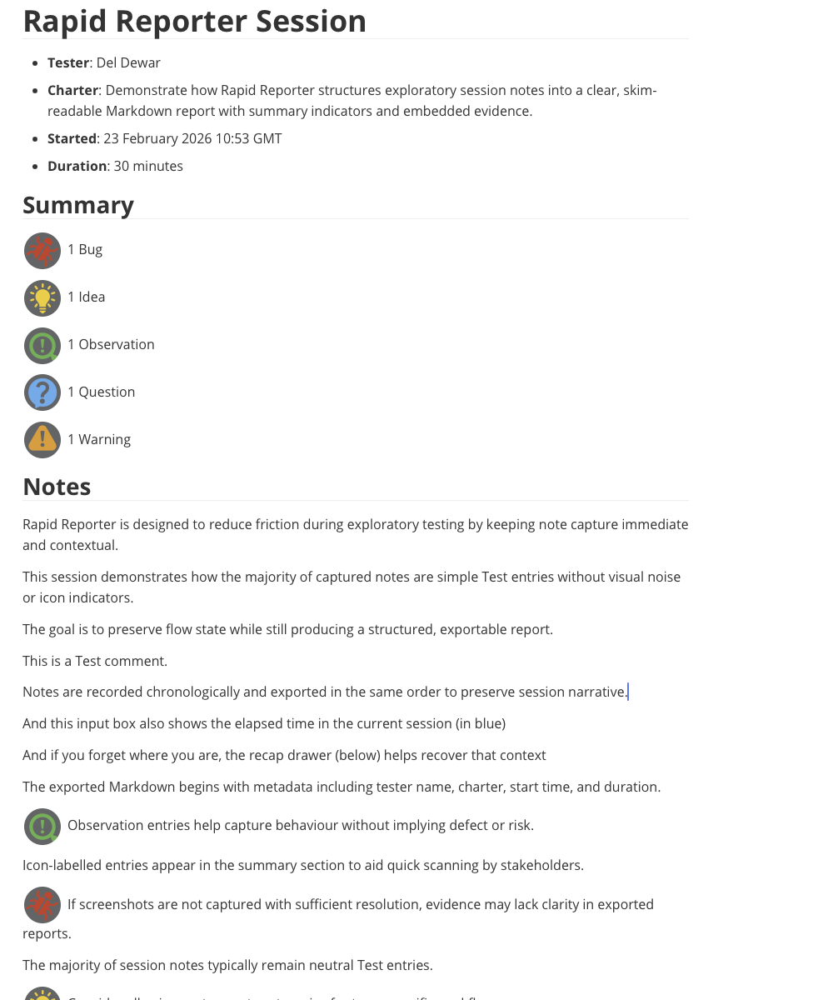

# Rapid Reporter

[](https://github.com/deefex/rapid-reporter/actions/workflows/ci.yml)

Rapid Reporter is a lightweight desktop tool for capturing categorised notes, screenshots and code/data snippets during session-based exploratory testing (SBTM).

## Origin and Lineage

Rapid Reporter was originally conceived and implemented by Shmuel Gershon. The original Windows executable is still available [here](https://testing.gershon.info/reporter/).

Mac users like myself were unable to use the original tool, so I created an early Mac-specific port without access to the original source code. That attempt can still be found [here](https://github.com/deefex/Rapid_Reporter_BETA). However, due to the rapid evolution of Xcode and Swift at the time, maintaining it became impractical.

## This Modern Re-Implementation

This project is a complete rewrite using modern, cross-platform technologies so Rapid Reporter can run on Windows, macOS, and at stretch, Linux.

It is built with:
- Tauri v2
- React + TypeScript
- Tailwind CSS
- Rust backend
- Vitest + Testing Library (frontend component & integration tests)
- GitHub Actions CI (frontend + Rust tests on every push/PR)


---

## Screenshots

### Startup Screen



### Main Instrument Panel (Recap Closed)



### Main Instrument Panel (Recap Open)



---
## Where exports are saved

When you end a session, Rapid Reporter writes an export folder into your home directory.

- **macOS:** `~/RapidReporter-YYYY-MM-DD-HHMM/`
- **Windows:** `%USERPROFILE%\\RapidReporter-YYYY-MM-DD-HHMM\\`

Each export folder contains the Markdown report plus an `assets/` folder (icons + screenshots).

## 📄 Example Export

Rapid Reporter exports structured, portable Markdown reports including session metadata, summary indicators, chronological notes, embedded screenshots, and formatted code snippets.

Click the preview below to view the full sample report.

<a href="docs/sample-report.pdf">
  
</a>

---

## macOS Installation Notes

If you download and run the macOS app, you might encounter security warnings or blocked launches due to macOS Gatekeeper.

To install and open the app:

1. Download the `.dmg` file and drag the app to `/Applications`.
2. Try to open the app normally (e.g. via Finder or Launchpad).
3. If macOS blocks it with a warning, open System Preferences → Security & Privacy → General.
4. Confirm when prompted.

### Alternative: Remove Quarantine via Terminal

If macOS still refuses to open the app, you can manually remove the quarantine attribute:

```bash
xattr -dr com.apple.quarantine "/Applications/Rapid Reporter.app"
```

Then try launching the app again.

This simply removes macOS's download quarantine flag from the application bundle.

Future releases may include proper code signing and notarisation.

## Credits and Inspiration

Rapid Reporter was originally conceived and implemented by Shmuel Gershon, whose work introduced a generation of testers to fast, session-centric note taking aligned with Session-Based Test Management (SBTM) principles.

This project is an independent modern re-implementation inspired by the original tool. All source code in this repository has been written from scratch.

## Artwork and Icons

The Rapid Reporter application icon and all category icons were designed from scratch by **Mary (MD Creations)** and are used with permission.

The artwork is original and forms part of the Rapid Reporter visual identity.

You can find more of Mary’s work at [MD Creations](https://md-creations.co.uk/).

---

## Current Features

### Session management
- Start a session with:
  - Tester Name (persisted between sessions)
  - Charter (multi‑line supported)
  - Duration (30, 60, 90, 120 minutes, or unlimited)
- Always‑on‑top instrument panel
- Visual session progress indicator
- Confirmation prompt before ending session
- Clean exit option from start screen

### Fast note capture
- Keyboard‑first note entry
- Categorised notes:
  - Test
  - Bug
  - Warning
  - Observation
  - Question
  - Idea
  - Snippet (for structured/code content)
- Prefix indicator for note type
- Instant commit with Enter
- Multi‑line entry supported
- Snippet notes exported as fenced Markdown code blocks

### Screenshot capture
- One‑click full screen screenshot capture
- Region (area) capture via drag‑selection overlay (multi‑monitor aware)
- Screenshots recorded as first‑class note type
- Stored with unique timestamped filenames
- Automatically copied into export folder
- Exported as embedded images in Markdown report
- Overlay supports multi‑monitor setups
- Cancel region capture with Esc

### Recap panel
- Shows the last 6 notes
- Prevents context loss during sessions
- Stable layout (no scrolling or UI shift)
- Supports screenshots and snippet preview

### Markdown export
- Export session to structured Markdown report
- Export includes:
  - Metadata header formatted as bold bullet list (Tester, Charter, Started, Duration)
  - Icon‑based Summary section (Bug, Idea, Observation, Question, Warning — only shown when present)
  - Notes in chronological order
  - Icons for Bug, Warning, Observation, Question, Idea (to draw the reader's attention)
  - Embedded screenshots
  - Snippet code blocks
- Fully portable export folder structure:

```text
RapidReporter-YYYY-MM-DD-HHMM/
  RapidReporter-YYYY-MM-DD-HHMM.md
  assets/
    icons/
    screenshots/
```
- Rust unit tests validate summary generation and pluralisation logic

---

## Architecture

Frontend:
- React
- TypeScript
- Tailwind CSS

Backend:
- Rust (Tauri)
- Screenshot capture via Tauri plugin
- File management via Rust commands

Storage:
- Session data held in memory during session
- Exported reports written to user's home directory
- Assets (icons, screenshots) embedded into export folder

---

## Development

### Requirements

- Node.js 18+
- Rust
- macOS, Windows, or Linux

### Install dependencies

```bash
npm install
```

### Run in development

```bash
npm run desktop
```

### Run Rust unit tests

Rapid Reporter includes Rust unit tests covering core Markdown export logic (e.g. summary generation and pluralisation).

From the `src-tauri` directory, run:

```bash
cargo test
```

All tests must pass before merging changes that affect backend export behaviour.

### Run frontend tests

Rapid Reporter includes React component tests and App-level integration tests using Vitest and Testing Library.

Run in watch mode:

```bash
npm test
```

Run once (for CI or pre-merge validation):

```bash
npm run test:run
```

Frontend tests cover:
- StartSessionModal validation logic
- InstrumentPanel behaviour (note entry, type cycling, recap toggle, end session)
- App-level flow (start session → capture UI → end session → export)
- Mocked Tauri command invocation boundaries

### Continuous Integration

Rapid Reporter uses GitHub Actions to automatically run:

- Frontend tests (Vitest)
- Rust unit tests (cargo test)

on every push and pull request.

Linux system dependencies required for Tauri are installed during CI to ensure backend compilation succeeds on Ubuntu runners.

All checks must pass before merging changes into `main`.

### Build release version

```bash
npm run tauri build
```

---

## Project Structure

```text
src/
  App.tsx
  App.test.tsx
  components/
    InstrumentPanel.tsx
    InstrumentPanel.test.tsx
    StartSessionModal.tsx
    StartSessionModal.test.tsx

src-tauri/
  src/
    lib.rs

vite.config.ts
vite.setup.ts
README.md
```

---

## Backlog / TODO

### Export improvements

- [ ] Export session to PDF (from markdown)?

### Usability improvements

- [ ] Toast notification after export (show destination folder + quick “Open folder” action)
- [ ] Click screenshot in recap to open file
- [ ] Keyboard shortcut for screenshot capture
- [ ] Autosave session recovery

### Future enhancements

- [ ] Session import / resume
- [ ] Rich HTML export
- [ ] End-to-end (E2E) tests against packaged Tauri build

---

## Goals

Rapid Reporter aims to:

- Minimise friction during exploratory testing
- Preserve tester flow state
- Capture evidence quickly
- Produce useful session artefacts

---

## License

MIT License © 2026 Del Dewar
See LICENSE file for details.